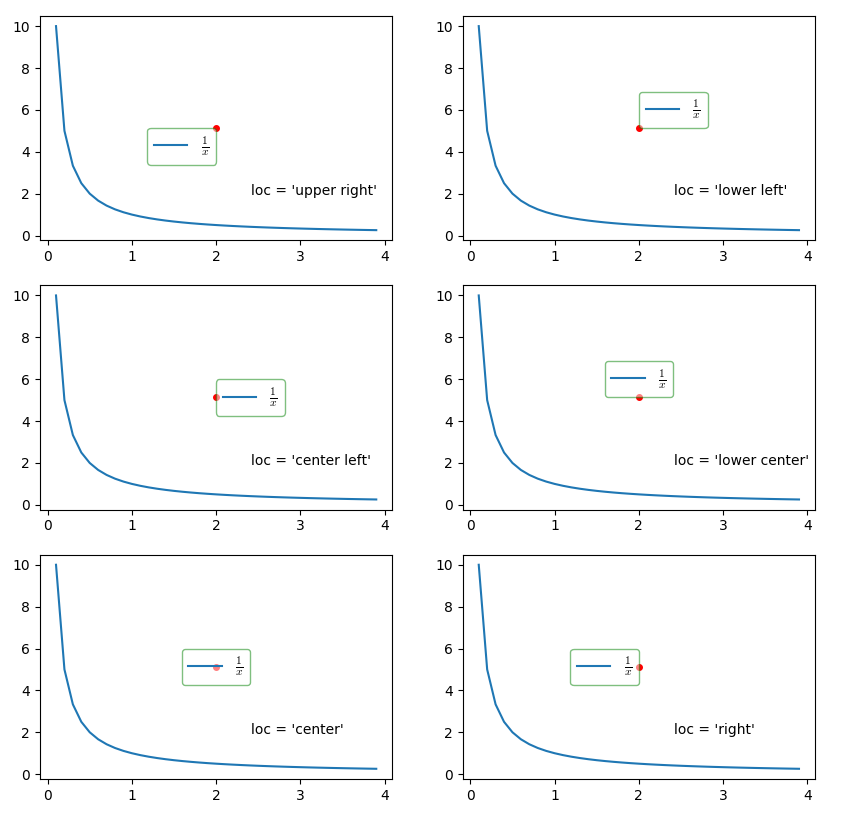
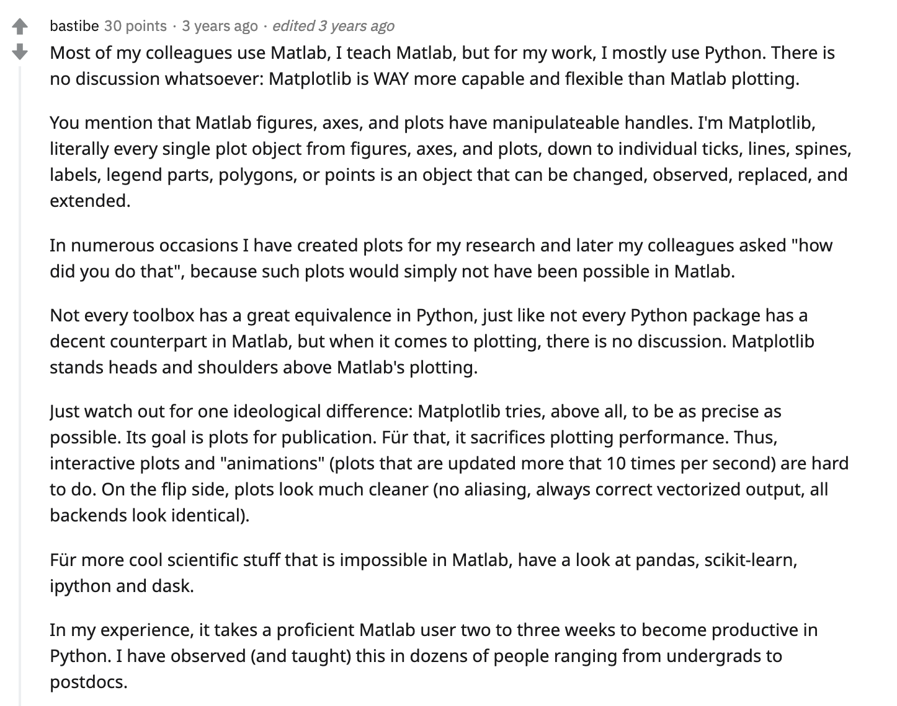
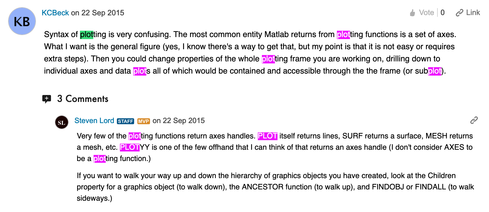
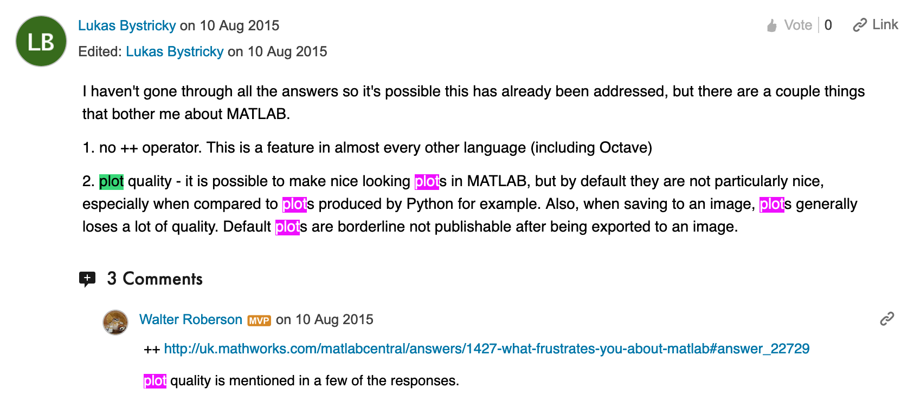
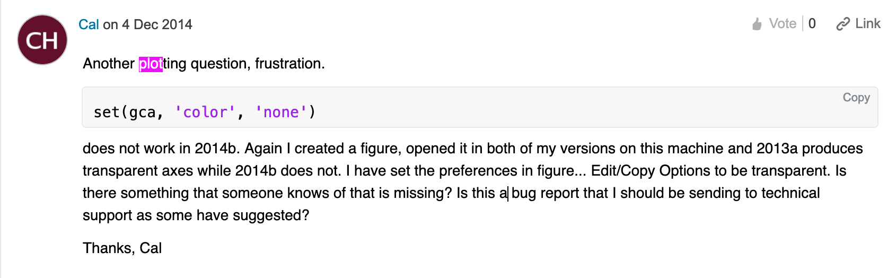
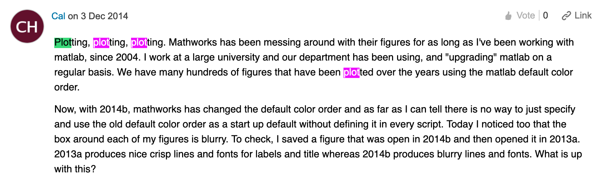
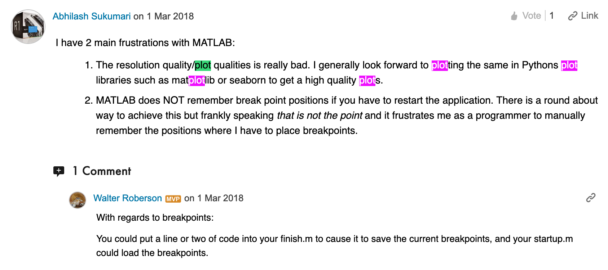

# scientific plotting in python (March 12th, 2020)

### docs
- [matplotlib plt API](https://matplotlib.org/3.2.0/api/_as_gen/matplotlib.pyplot.html#module-matplotlib.pyplot)
- [matplotlib Fig/Axes API](https://matplotlib.org/3.2.0/api/axes_api.html#matplotlib.axes.Axes)
- [stylesheet reference](https://matplotlib.org/3.1.0/gallery/style_sheets/style_sheets_reference.html)
- [tight layout](https://matplotlib.org/tutorials/intermediate/tight_layout_guide.html)
- [saving figures](https://uk.mathworks.com/help/matlab/ref/saveas.html)

### tutorials
- [Rougier's Matplotlib tutorial](https://github.com/rougier/matplotlib-tutorial)
	- note that these scripts are out of date! but the explanations are fine.
- [placing legends properly](https://jdhao.github.io/2018/01/23/matplotlib-legend-outside-of-axes/)
- [more legend help](https://stackoverflow.com/questions/4700614/how-to-put-the-legend-out-of-the-plot)
- [colorbar madness](https://stackoverflow.com/questions/13784201/matplotlib-2-subplots-1-colorbar)
- [colorbar positioning tutorial](https://jdhao.github.io/2017/06/11/mpl_multiplot_one_colorbar/)

### legend cheatsheet

## What People Are Sayin' 'Bout Matlab...

